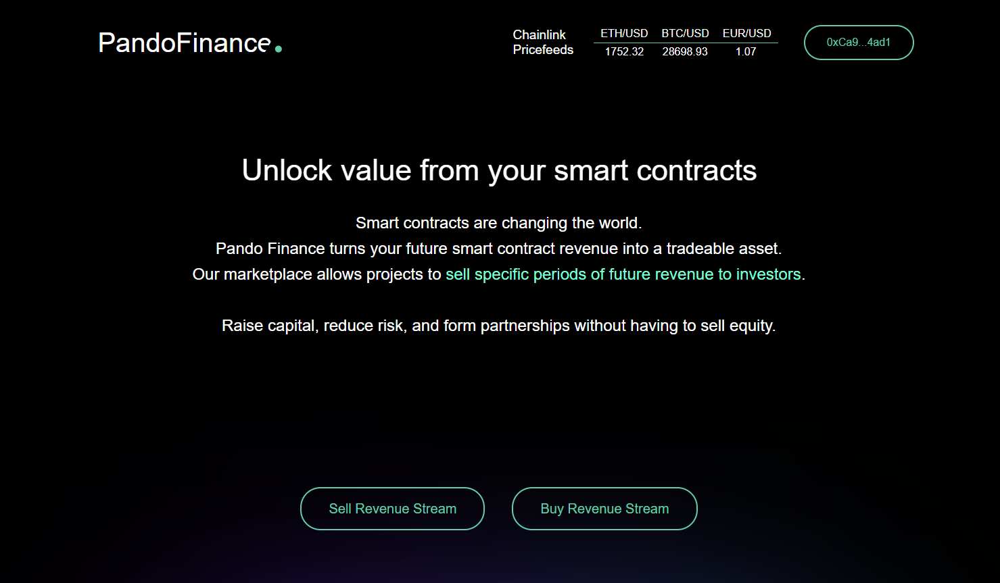

# Pando Finance
Pando Finance is a marketplace for future smart contract revenue.
It connects participants who deploy capital ("Buyers") with entities that control a wallet address that receives regular smart contract-generated on-chain payments ("Sellers").


# START HERE:
- [**Pando Finance Dapp**](https://www.pandofinance.dev/pando/) is running live on the cloud.
- [**Documentation**](./doc/Documentation.md) describes the project and the dapp in detail.
- [**Slide Deck**](./doc/pdf/Pando_Finance_v1.pdf) describes the project.
- [**YouTube Video**](https://youtu.be/FM7gHj1SJug) is the demo video for the hackathon.

### Pando Finance Main Window



## Pando Finance Project Team
Our team consists of DeFi developers who are creating value through innovation.

## Product Developer
Maximilien Le Sieur \
HARVARD BUSINESS SCHOOL \
MBA, Class of 2022 \
https://www.linkedin.com/in/maximilien-le-sieur/ \
 

## Front End Developer
Maria Mironova \
https://github.com/webstalt \
 

## Smart Contract Developer
Albert Vo \
https://github.com/albert-vo-crypto \
 

## Smart Contract Developer
Wilson Wu \
https://github.com/Wilson-Wu1 \
 


## Getting Started

First, run the development server:

```bash
npm run dev
# or
yarn dev
```

Open [http://localhost:3000](http://localhost:3000) with your browser to see the result.

You can start editing the page by modifying `pages/index.js`. The page auto-updates as you edit the file.

[API routes](https://nextjs.org/docs/api-routes/introduction) can be accessed on [http://localhost:3000/api/hello](http://localhost:3000/api/hello). This endpoint can be edited in `pages/api/hello.js`.

The `pages/api` directory is mapped to `/api/*`. Files in this directory are treated as [API routes](https://nextjs.org/docs/api-routes/introduction) instead of React pages.

## Learn More
This is a [Next.js](https://nextjs.org/) project bootstrapped with [`create-next-app`](https://github.com/vercel/next.js/tree/canary/packages/create-next-app).

To learn more about Next.js, take a look at the following resources:

- [Next.js Documentation](https://nextjs.org/docs) - learn about Next.js features and API.
- [Learn Next.js](https://nextjs.org/learn) - an interactive Next.js tutorial.

You can check out [the Next.js GitHub repository](https://github.com/vercel/next.js/) - your feedback and contributions are welcome!

## Deploy on Vercel

The easiest way to deploy your Next.js app is to use the [Vercel Platform](https://vercel.com/new?utm_medium=default-template&filter=next.js&utm_source=create-next-app&utm_campaign=create-next-app-readme) from the creators of Next.js.

Check out our [Next.js deployment documentation](https://nextjs.org/docs/deployment) for more details.
